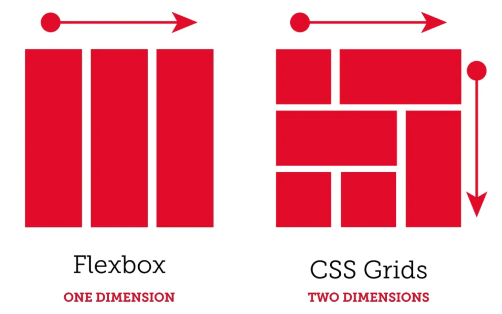

# Project 3: Around The U.S.

The _Around the U.S._ Webpage is the third project from TripleTen's software engineering program. This site is an interactive photo-sharing page where users can create a profile with It was created using HTML and CSS and is based on the design from a Figma specification document.

It was created using various responsive elements such as grids, media queries, and text overflow for accesbiliy across different devices.

## Project Features

- Grid Layout
- Media Queries
- Text-overflow
- Flat BEM file structure

**Grid Layout**

The grid layout was the most essential component of the webpage to make it responsove throughout different screen sizes across devices. Using display:grid over flexbox makes the page more flexible when viewed on phones as the page transforsms into a more veritcal platform by collapsing elements instead of shrinking.

**Media Queries**

Media queries were set at 1280px, 775px, and 618px to make them easier to browse on desktops, tablets, and phones.

**Text-overflow**

Various styles were given to components to prevent text overflow from breaking the design. Styles such as text-overflow, white-space, overflow, and max-width help protecting the design and making them more flexible as different users may input different data.

**Flat BEM file structure**

BEM file structure was used to make future edits and debugging easier for the user.

## GitHub Pages Link can be found here: https://robxnav.github.io/se_project_aroundtheus/

## Link to Video Overview: https://youtu.be/p0QkLe036Ek
